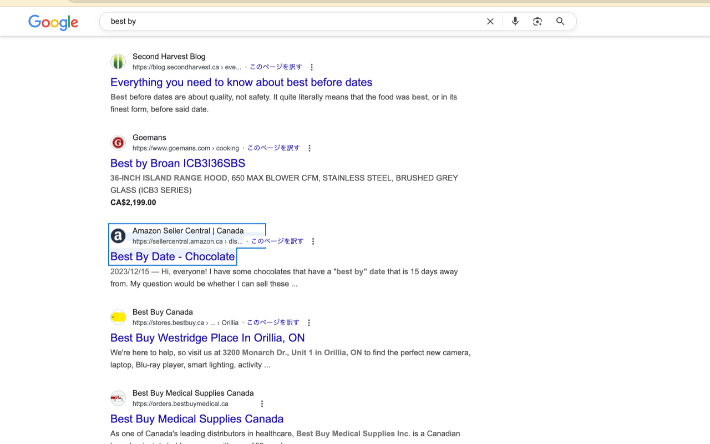

# JK Enter

[🇺🇸 English](#english) | [🇯🇵 日本語](#japanese)

  

A Chrome extension that provides Vim-like keyboard navigation for search result pages.

Pressing Enter immediately after searching opens the first search result instantly.

## Distribution

https://chromewebstore.google.com/detail/jk-enter/ojkdcnmekahoajljhmilnbmnngfghhbb

## Features

  
  
<em>JK Enter highlighting search results with keyboard navigation</em>

- `j` key: Select next search result
- `k` key: Select previous search result
- `Enter` key: Open selected search result
- Highlight selected search result
- Auto-scroll functionality

## Supported Search Engines

- Google Search (google.com, google.co.jp)

## Installation

### Development Mode (Manual Installation)

1. Open `chrome://extensions/` in Chrome
2. Enable "Developer mode" in the top right
3. Click "Load unpacked"
4. Select this folder

### Usage

1. Search for something on a search engine
2. Use the following keys on the search results page:
   - `j`: Select result below
   - `k`: Select result above
   - `Enter`: Open selected result

## File Structure

- `manifest.json`: Extension configuration file
- `content.js`: Main functionality script
- `styles.css`: Highlight styles
- `icon.svg`: Extension icon

## Technical Specifications

- Manifest V3 compliant
- Implemented using content scripts

## Contributing

Found a bug or have an improvement idea? Feel free to open an issue or submit a pull request! No specific format required - just make it clear what you're trying to fix or improve.

## License

This project is distributed under the MIT License. See the [LICENSE](LICENSE) file for details.

---

## Japanese

検索結果画面で Vim ライクなキーボードナビゲーションを提供する Chrome 拡張機能です。

## 配布

https://chromewebstore.google.com/detail/jk-enter/ojkdcnmekahoajljhmilnbmnngfghhbb

## 機能

  
  
<em>キーボードナビゲーションで検索結果をハイライト表示</em>

- `j` キー: 次の検索結果を選択
- `k` キー: 前の検索結果を選択
- `Enter` キー: 選択中の検索結果を開く
- 選択中の検索結果をハイライト表示
- 自動スクロール機能

## 対応検索エンジン

- Google 検索 (google.com, google.co.jp)

## インストール方法

### 開発モード（手動インストール）

1. Chrome で `chrome://extensions/` を開く
2. 右上の「デベロッパーモード」を有効にする
3. 「パッケージ化されていない拡張機能を読み込む」をクリック
4. このフォルダを選択

### 使用方法

1. 検索エンジンで何かを検索
2. 検索結果画面で以下のキーを使用：
   - `j`: 下の結果を選択
   - `k`: 上の結果を選択
   - `Enter`: 選択中の結果を開く

## ファイル構成

- `manifest.json`: 拡張機能の設定ファイル
- `content.js`: メイン機能のスクリプト
- `styles.css`: ハイライトスタイル
- `icon.svg`: 拡張機能のアイコン

## 技術仕様

- Manifest V3 準拠
- コンテンツスクリプトによる実装

## コントリビューション

バグを見つけたり改善案がありましたら、お気軽にIssueを立てるかPull Requestを送ってください！特定の形式は気にしません。何を修正・改善しようとしているかわかるようにお願いします。

## ライセンス

このプロジェクトは MIT License の下で配布されています。詳細は [LICENSE](LICENSE) ファイルを参照してください。

